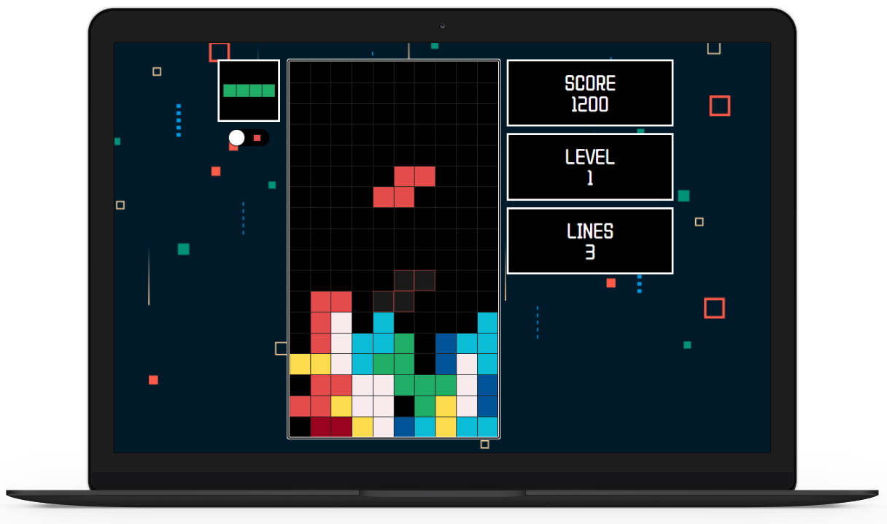

# Tetris Game Project

> Fully responsive tetris game built with ReactJS

	  
	  
	  
	  

<h1 align="center">
  
  
  
</h1>

In this project, we will implement a complete CI/CD pipeline using GitHub Actions, integrating key tools and best practices for secure and reliable delivery.
Continuous Integration (CI) Within the GitHub workflow, we will:
- Install dependencies for our Node.js application.
- Perform static code analysis using the SonarQube platform and enforce a Quality Gate. If any quality issues are detected, the workflow will     fail immediately, ensuring only high-quality code proceeds further.
- Containerize the application by building a Docker image.
- Run a vulnerability scan on the Docker image using Trivy. If no critical vulnerabilities are found, the image will be published to JFrog        Artifactory for secure storage and distribution.
This ensures that every build is tested, analyzed, secured, and stored before moving forward.
Continuous Deployment (CD) For deployment, we will follow the GitOps approach using Argo CD:
- The GitHub workflow will update the Docker image tags in the Git repository.Argo CD will detect these changes and automatically synchronize them to the Kubernetes cluster, deploying the updated application seamlessly.
Post-Build Security
- Additionally, we will run Gitleaks workflows on the main branch to scan for and eliminate any accidental exposure of sensitive data such as API tokens, passwords, SSH keys, or other secrets.

With this pipeline, we achieve a secure, automated, and production-ready CI/CD process, covering everything from code quality and vulnerability management to GitOps-driven deployments.

JFrog’s integration of OpenID Connect (OIDC) with GitHub Actions allows organizations to establish a secure, trust-based relationship between their CI/CD workflows and the JFrog Platform. This integration streamlines authentication by eliminating the need for manually creating and managing tokens for each GitHub Action, reducing operational overhead and enhancing security.

In this project, I will demonstrate how to implement and leverage this integration to enable seamless, efficient, and secure token management within GitHub Actions.We have already set kubernetes cluster in EKS 
       

Step 1:
Install the JFrog Artifactory Pro X Platform on Ubuntu 22.04.

Step 2:
Create three repositories in JFrog Artifactory:

Local Repository – for storing and managing internal build artifacts.

Remote Repository – for caching artifacts from external sources.

Virtual Repository – for providing a unified access point by aggregating local and remote repositories.
These repositories will be used to publish and manage build artifacts efficiently.

Step 3:
Create users and groups within Artifactory. Assign users to groups so they automatically inherit group-level permissions. Then, configure appropriate permissions for the groups to ensure secure and role-based access control.

# JFrog – GitHub OIDC Integration
Let’s say you have your own project hosted on GitHub with workflows running on GitHub Actions — that’s already powerful. But when you combine it with JFrog Artifactory, it becomes even more impactful.
For example, a common setup looks like this:

`- name: Setup JFrog CLI
  uses: jfrog/setup-jfrog-cli@v3
  env:
    JF_URL: ${{ secrets.JF_URL }}
    JF_ACCESS_TOKEN: ${{ secrets.JF_ACCESS_TOKEN }}
`

The challenge here is that your token is stored manually in GitHub secrets. Imagine if that token gets revoked, deleted by mistake, or worse, compromised and exposed — that creates a serious security risk.

The solution is JFrog – GitHub OIDC integration, which allows us to dynamically generate short-lived tokens with fine-grained access control. You decide whether a token should only allow publish, fetch, or admin actions, and you can scope tokens to specific users, groups, or workflows.

# Quick Demo: Setting Up the Integration
Step 1:
Navigate to Administration → Platform Management → Managed Integrations in the JFrog Platform.

Step 2:
Click New Integration, select OpenID Connect (OIDC), then provide:
Provider name
Organization
(Optional) Audience – an extra layer of verification to ensure the token is issued to the correct audience.

Step 3:
Click Show Snippet. The snippet generated will help you integrate OIDC directly into your GitHub workflow. Save the integration.

Step 4:
Create your first Identity Mapping. You can define multiple mappings, each with different priorities. This gives you flexibility to assign the most relevant token depending on claims provided by GitHub’s OIDC provider.
-The claim JSON is the trust object GitHub sends to JFrog.
-JFrog uses this to map back tokens with the right permissions.

Step 5:
For example, you can map a claim such as workflow: my-workflow. If the workflow name changes, the token will no longer be granted. 
That’s why it’s critical to verify all details in the claim.
- Save the identity mapping with the desired token scope.
- Configure the token expiration time according to your security requirements.

Step 6:
Update your GitHub workflow to request an ID token instead of relying on stored secrets. This allows the workflow to exchange the ID token for a JFrog access token — no static tokens stored in GitHub.

Step 7:
Finally, configure Docker with JFrog Artifactory so that your workflows can securely push and pull container images directly from Artifactory, using dynamically generated OIDC tokens.

With this setup, your GitHub Actions pipelines become more secure, more automated, and easier to manage — no more worrying about manually managing long-lived secrets.

It is worth noting that this process can also be automated using Terraform, enabling you to provision users, groups, and configure authentication and authorization across your organization. This can be seamlessly integrated with identity providers such as LDAP, HashiCorp Vault, or Active Directory.

Create users and groups within Artifactory. Assign users to groups so they automatically inherit group-level permissions. Then, configure appropr
iate permissions for the groups to ensure secure and role-based access control.
